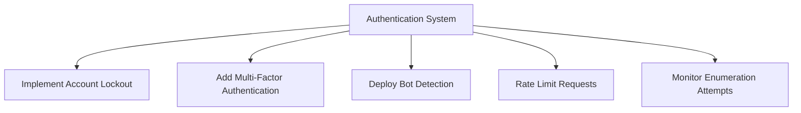

# Automates Credential Stuffing by Reverse Brute Force

**⚠️ IMPORTANT DISCLAIMER**  
This script is provided for **educational purposes only** to demonstrate web automation concepts. Unauthorized use against real systems is illegal and violates ethical guidelines.

## Description

This Python script demonstrates how automated credential testing could theoretically work against school portals using Selenium. It serves as:
- A web automation learning tool
- A cybersecurity awareness demonstration
- An example of why proper authentication safeguards are necessary

## Technical Details

**Type of Attack Demonstrated:**  
Reverse brute force credential testing (single ID with multiple last names)

**Components:**
- Selenium WebDriver for browser automation
- Basic input field interaction
- Simple timing mechanisms
- Result validation through URL changes

## Research Methodology
**This project demonstrates how vulnerable authentication systems could potentially be exploited through open-source intelligence (OSINT) and automation.**
- Located the student portal at https://5starstudents.com/americanhs
- Discovered ID enumeration was possible through the staff directory sorting function
- Accessed public staff directory at https://fremontunified.org/american/about/staff-directory/
- Compiled a list of last names from faculty members

## Ethical Warning

🚨 **This script must NOT be used for:**
- Unauthorized access attempts
- Testing systems without permission
- Harvesting personal information
- Any illegal activities

Violations may result in:
- Legal consequences (CFAA, FERPA violations)
- Academic penalties
- Criminal charges

Legal & Ethical Considerations:
Accessing or extracting personal information without explicit authorization is illegal in most jurisdictions (violating laws like FERPA, GDPR, etc.)
School systems often have strict security policies - unauthorized access may result in legal consequences or academic penalties

Intended Use:
This material is provided solely for educational purposes to demonstrate web automation concepts
It is meant for cybersecurity professionals, educators, and students learning about:
Ethical web scraping
System vulnerability awareness
Responsible disclosure practices

Prohibited Uses:
Do not use this information to access systems without written permission
Never collect, store, or distribute personal student data
Avoid using automated tools against systems that prohibit them in their ToS

Responsibility:
The author provides this information with the expectation of ethical use
Users assume full liability for any misuse
Educational institutions should use this knowledge to strengthen their security

Ethical Alternatives:

Always seek explicit permission before testing systems
Use school-approved APIs when available
Report vulnerabilities through proper channels
By studying this material, you agree to use this knowledge lawfully and ethically.


## Legal Alternatives for Learning

1. **Authorized Penetration Testing** - Only with written permission
2. **Bug Bounty Programs** - Legal vulnerability disclosure
3. **Capture The Flag (CTF)** - Ethical hacking competitions
4. **Sandbox Environments** - Practice on intentionally vulnerable systems

## Usage Requirements

To run this demo (for educational purposes only):

1. Install dependencies:
```bash
pip install selenium pyfiglet
